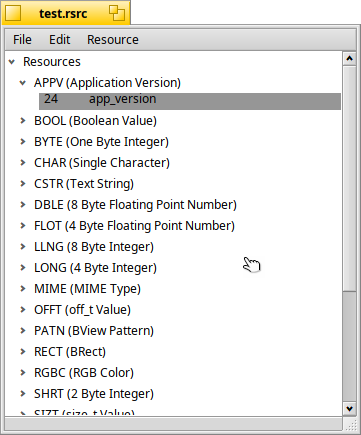
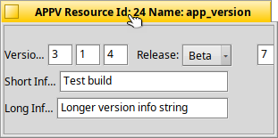

# Resourcer

Resourcer is an open-source resource editor for the BeOS. It contains editors for 32 data types, including windows (for building app interfaces), cursors, images, sounds, movies, icons, and text. It is distributed under the BSD license. You get the source and the latest stable binaries from the downloads page. Please help out if can; Resourcer can not improve without your help.
### News:

Resourcer released under the BSD license.

## Building

On Haiku, with the development tools installed, run `make` in the top level
folder. The result is in the `build` folder: the `Resourcer` application and
an `editors` folder with one add-on per resource type. Resourcer finds its
editors in the `editors` folder next to the application, so you can run
`build/Resourcer` right where it is.

* `make editor-TEXT` builds a single editor
* `make app`, `make editors` and `make reslib` build just that part
* `make test` compiles the sample resource file, see Testing below
* `make clean` removes everything that was built

The code is kept compatible with gcc2 (`x86_gcc2` hybrid builds of Haiku).

## Testing

`make test` compiles `tests/test.rdef` into `build/test.rsrc`. The file holds
one resource of most of the types Resourcer has editors for (numbers, text,
colors, rectangles, an application version and so on). Open it in Resourcer
and double-click a resource to try its editor.

